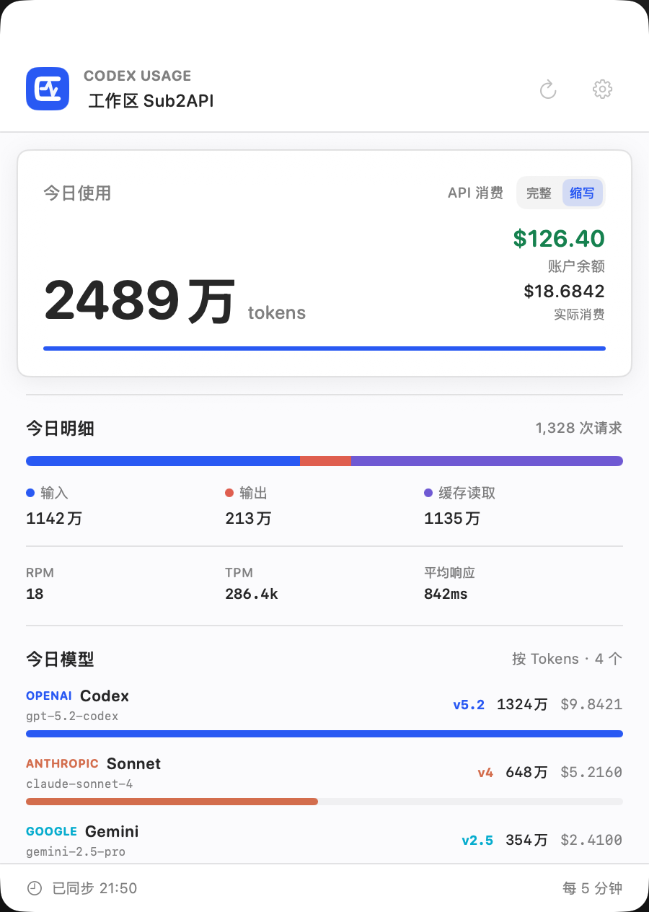
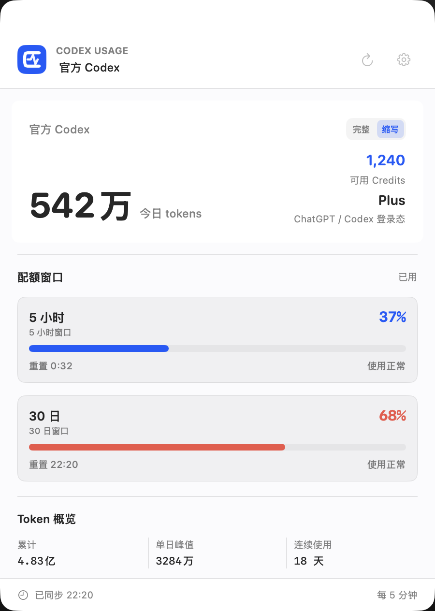
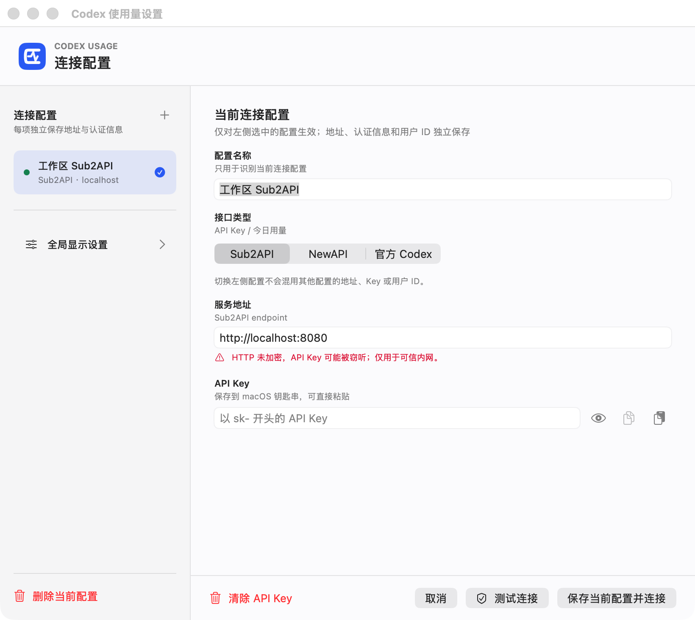

# Codex Usage Menu Bar

> 在 macOS 菜单栏查看 Codex 用量、配额、余额和模型使用情况。

**Codex Usage Menu Bar** 将 Sub2API、NewAPI 中转服务和官方 Codex 的关键数据集中到一个轻量面板中，减少频繁打开网页或终端的麻烦。

  <a href="https://github.com/Jimmyzxk/codex-usage-menubar/releases/latest">下载最新版</a>
  &nbsp;·&nbsp;
  <a href="https://github.com/Jimmyzxk/codex-usage-menubar/issues">提交问题</a>
  &nbsp;·&nbsp;
  <a href="https://github.com/Jimmyzxk/codex-usage-menubar/releases">查看更新</a>

> 支持 macOS 13 及以上版本。应用通过 GitHub Release 直接分发，首次打开可能需要在“隐私与安全性”中确认。

## 先看效果

以下截图使用脱敏演示数据，不代表任何真实账户。

<table>
  <tr>
    <td align="center"> 代理服务：今日用量与模型</td>
    <td align="center"> 官方 Codex：5 小时与 30 日配额</td>
    <td align="center"> 多供应商配置与切换</td>
  </tr>
</table>

## 支持的数据来源

| 来源 | 可以查看 | 需要填写 |
| --- | --- | --- |
| **Sub2API** | 今日请求、输入/输出/缓存 tokens、消费、余额、RPM、TPM、响应时间、当日模型 | 服务地址 + API Key |
| **NewAPI** | 今日请求、tokens、剩余额度、RPM、TPM、响应时间、当日模型 | 控制台地址 + AccessToken + 用户 ID |
| **官方 Codex** | 5 小时、30 日配额、重置时间、Credits、Token 概览 | 本机 Codex 登录态，不需要 API Key |

应用支持保存多个连接配置。每个配置独立保存地址和认证信息，面板会同时刷新已配置来源，并提供供应商总览和快速切换；主题、面板尺寸、刷新频率和 tokens 显示方式属于全局设置。

## 主要能力

- 菜单栏快速查看当前配置的最新用量。
- 支持完整数字或紧凑数字显示，例如 `24,893,760` 或 `2489 万`。
- 显示当天使用过的模型、版本、请求数和 tokens。
- 保存每个供应商的小时采样和日汇总，最多保留 90 天，用于补充服务端历史数据。
- 多供应商同时显示同步状态、今日 tokens 和账户余额。
- 支持跟随系统、浅色和深色外观，以及多种面板风格和尺寸。
- API Key 和 NewAPI AccessToken 使用 macOS 钥匙串保存。

## 安装

1. 打开 [最新 Release](https://github.com/Jimmyzxk/codex-usage-menubar/releases/latest)。
2. Apple 芯片下载 `arm64`，Intel Mac 下载 `x86_64`；一般优先下载 DMG。
3. 将应用拖入“应用程序”，首次启动时在 Finder 中右键选择“打开”。
4. 如果仍被拦截，到“系统设置 → 隐私与安全性”选择“仍要打开”。

这是未使用 Apple Developer ID 公证的直接分发包。应用没有把任何 API Key 打包进去，也不会替用户完成第三方服务授权。

## 3 步开始使用

1. 点击菜单栏中的 Codex Usage 图标，打开设置。
2. 在“连接配置”中新增配置，选择 Sub2API、NewAPI 或官方 Codex。
3. 填写信息并点击“测试连接”，成功后保存，再回到面板刷新。

### 配置提示

- **Sub2API**：填写服务地址和 API Key。粘贴时不需要手动添加 `Bearer ` 前缀。
- **NewAPI**：填写控制台根地址、AccessToken 和对应的数字用户 ID。AccessToken 不是调用模型的 `sk-...` API Key。
- **官方 Codex**：不填写 API Key 或代理地址；先确保本机官方 Codex/ChatGPT 已登录，普通 OpenAI API Key 不能代替官方登录态。

## 重要说明

- Sub2API 和 NewAPI 的模型统计按当天服务端日志聚合，表示“今天使用过哪些模型”。
- 官方 Codex 的公开接口主要返回配额窗口和 Token 数据，不保证提供模型明细、请求耗时或 RPM/TPM，因此官方模式不会猜测填充这些字段。
- NewAPI 的额度是站内 quota 单位，应用展示剩余额度，不主动换算成美元。
- HTTP 只适合本机或可信内网；对外服务请使用 HTTPS。

## 常见问题

### 看不到右上角图标

确认应用仍在运行。菜单栏图标较多时，macOS 可能将它收进控制中心或隐藏区域。

### 每次启动都提示钥匙串密码

新版本启动不会主动读取旧钥匙串条目。旧配置只会在你主动打开连接设置时迁移，必要时可能授权一次；如果仍然反复提示，可以清除当前凭据后重新保存。

### NewAPI 读取失败

依次确认地址是控制台根地址、AccessToken 仍有效、用户 ID 为数字且与令牌属于同一账户，并确认令牌拥有读取本人日志和账户信息的权限。

### tokens 显示切换没有效果

在全局显示设置中切换“完整/缩写”后重新打开菜单栏面板。该设置会同时影响菜单栏和面板。

## 隐私与安全

- 凭据保存在当前 Mac 的钥匙串中，不写入普通配置文件，也不会上传到本项目。
- 代理服务请求只发送到你填写的地址；官方模式通过本机 Codex app-server 读取登录态。
- 应用不包含统计分析或广告 SDK。
- 截图、Issue 和日志中不要包含 API Key、AccessToken、Cookie、Authorization 请求头、内网地址或账户数据。

## 问题反馈

请前往 [GitHub Issues](https://github.com/Jimmyzxk/codex-usage-menubar/issues)，选择“错误报告”或“功能建议”模板。

反馈时请提供 Codex Usage 版本、macOS 版本、Mac 芯片、数据来源、复现步骤和脱敏后的错误信息。涉及凭据泄露或安全漏洞，请使用 [GitHub 私密安全报告](https://github.com/Jimmyzxk/codex-usage-menubar/security/advisories/new)，不要公开粘贴敏感信息。

## 版权与许可

Copyright (c) 2026 Tony Holsten（GitHub：[@Jimmyzxk](https://github.com/Jimmyzxk)）。

本项目的源代码、界面设计、图标、截图和文档版权归作者所有。当前仓库未附带额外的开源许可；在作者明确发布许可之前，未经书面许可，不得复制、修改、再发布、销售或用于商业分发。GitHub 上的公开可见不等于自动授予使用许可。

本项目是独立的社区工具，与 OpenAI、ChatGPT、Codex、Sub2API 或 NewAPI 的维护方没有隶属、赞助或官方授权关系。相关名称和商标归其各自所有者所有。

## 开发者资料

构建、测试、接口契约、架构和 GitHub Release 维护说明请查看 [DEVELOPMENT.md](DEVELOPMENT.md)。
